# UML Multi-user Editor

This repository presents the source code of our senior year project at Polytechnique Montréal. 

This project contains three main components: 

- Leger: Android Mobile Application
- Lourd: Windows Desktop Application
- Serveur: Server Application

The goal of this project was to create a multi-user UML editor compatible with an Android mobile application and a Windows desktop application.

Here is preview of the different features of our UML Multi-user Editor:

This function let you resize the overall space of the canvas.

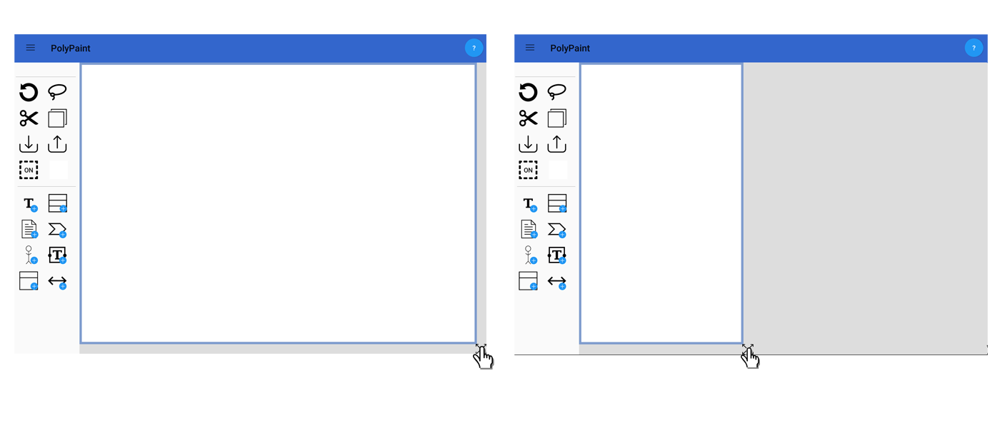

This section will show you all the actions you can do on shapes.

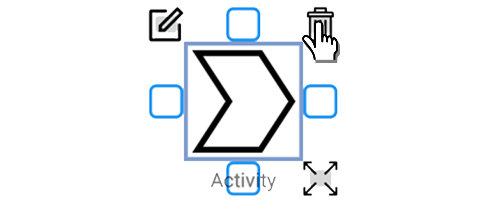

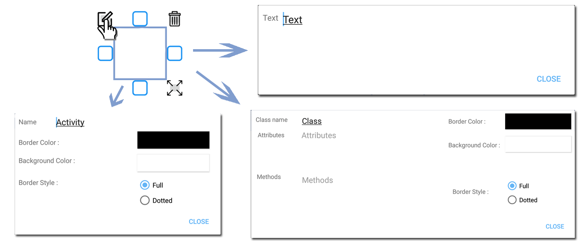

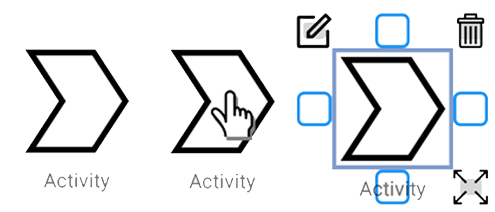

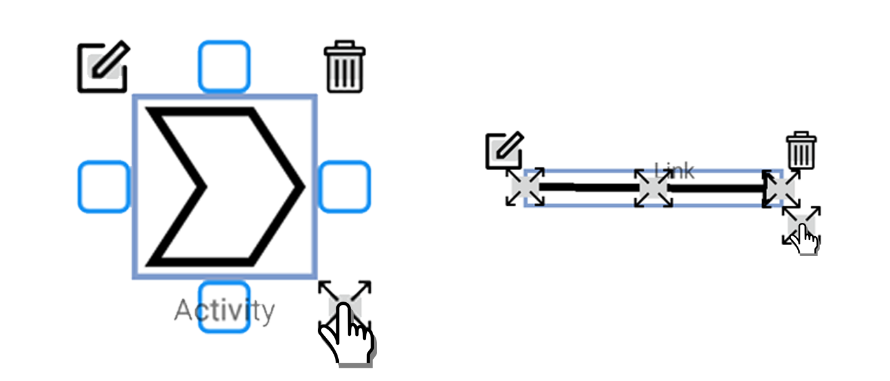

This section will show you all the actions you can do on links.

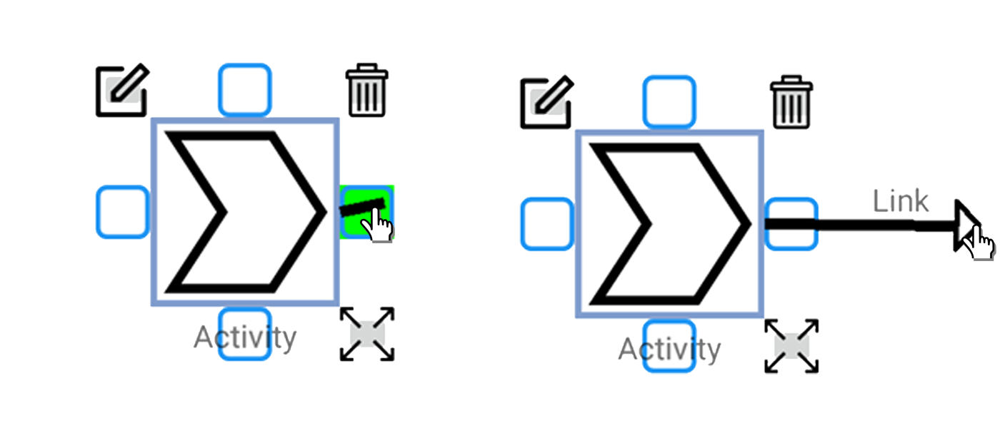

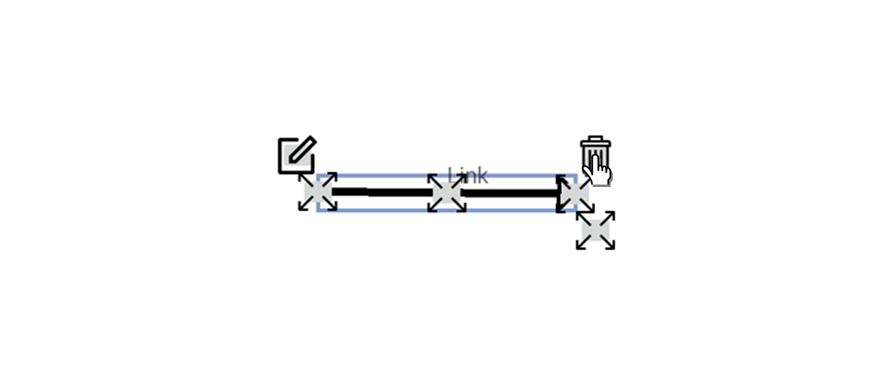

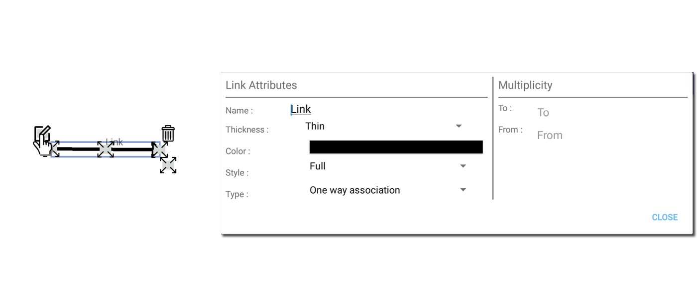

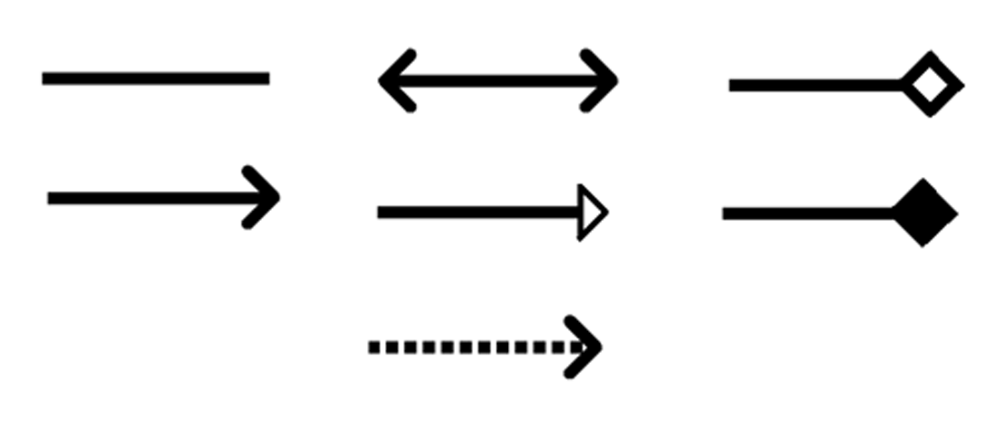

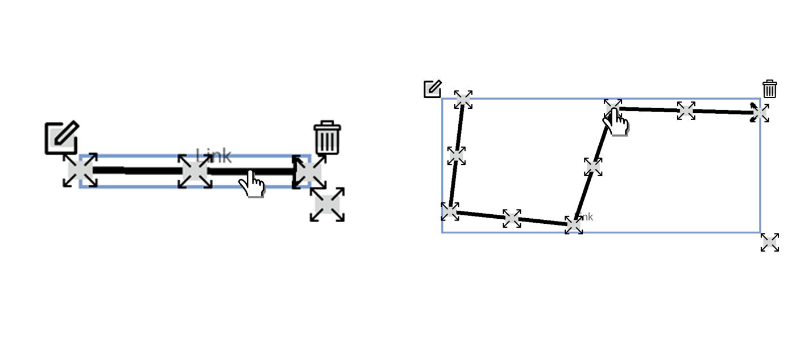

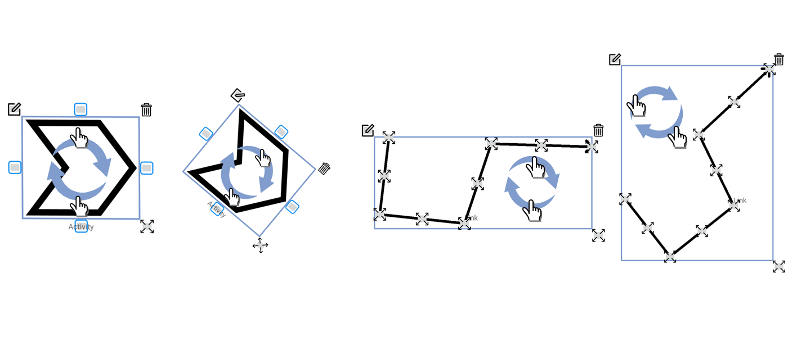

The Lasso tools will help you do action on multiple drawing element.

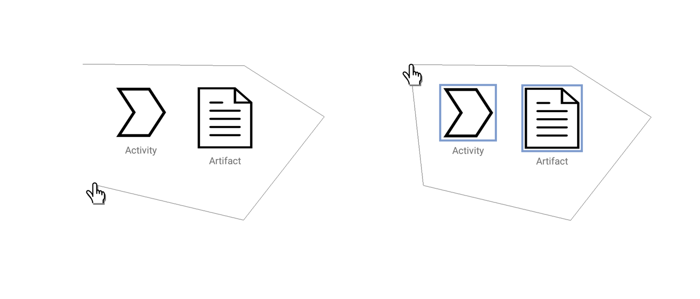

## Repository Structure

- **Documentation Folder**: Contains all the technical documents of the project.
- **Leger Folder**: Contains all the code for the Android Mobile Application.
- **Lourd Folder**:  Contains all the code for the Windows Desktop Application.
- **Serveur Folder**: Contains all the code for the Server Application.
- **svg Folder**: Contains all the .svg and .png files of the icons used in the project. 
- **tutoriel**: Contains all the files for the tutorial.
